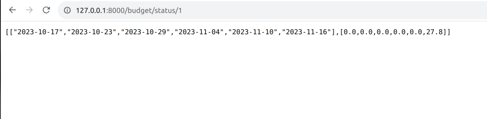

# FastAPI-backend

## Models

1. People - contains the unique ID and name of a person
2. Budget - contains budget details and a list of people involved
3. Transaction - transaction with foreign key reference to the People table

## APIs

1. Create - Creates a budget entry in the database
2. Status - Gives data for plotting the percentage of budget usage from the start day
3. Update - Update the amount value in the budget
4. Delete - Delete a budget entry

## Implementation details

The implementation of create, update and delete APIs is straightforward. 

The status API takes the budget ID as the input and fetches the start date, end date, category and people involved in the budget from the database. 
The period of status evaluation is from the start date to the earlier of end date and today. 
For example, if the start date is 20th Oct, the end date is 20th Nov and today is 17th Nov then we would fetch the transactions from 20th Oct to 17th Nov. 
Next, we fetch data asynchronously for various interval slices from the transaction table. This can be improved by fetching all data at once and processing everything in Python. 

Sample output of status API - This can be used for plotting the graph


## Pending tasks

1. Add testing code
2. Front-end
3. Additional functionality to handle notifications, erratic user behaviour

### Steps to execute the project

1. Install necessary modules 
```
pip install fastapi
pip install databases
```

2. Execute the commands in sql/readme.md file to create a database
3. Execute sql/sql_schema.sql to create tables
4. Execute sql/test_data.sql to populate the tables
5. Start the server


   
